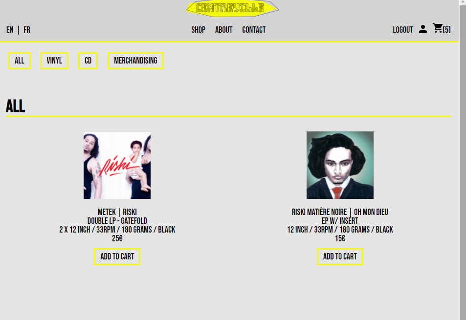
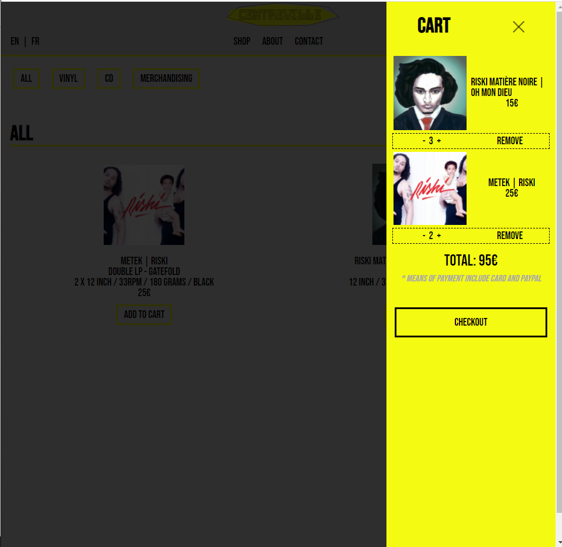

# Centreville - Music label e-commerce website

Centreville is a belgian record label mainly involved in rap music.

# MVP
The application allows users to 
- browse through the products
- switch languages between French and English
- create an account / sign in with Google
- make an order
- visualize the cart on any page
- pay by card or using Paypal
- add new products as an admin
- reach out to the admin through a contact form

# TECHSTACK
- React
- Firebase (authentication + firestore)
- Redux
- Redux-saga
- React-i18next
- React-router
- React-stripe
- SCSS

# INSTALL
You need to have npm installed on your machine.
After cloning the project, run `npm i` to install the dependencies. Run `npm run start` to start the app in development mode and allow reloading after edits.

